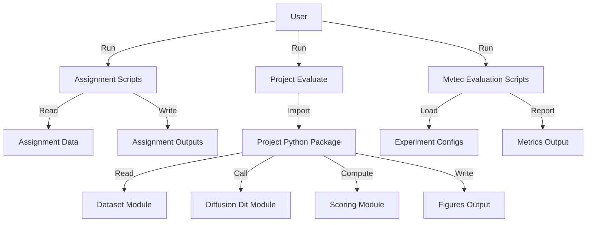

# UMD-Data612-Deep-Learning-Shrikanth-Vilvadrinath
*Deep learning coursework + a modular diffusion-based team project with reproducible environments, evaluation tooling, and formal reports.*


## Overview
This repository is a monorepo for UMD DATA612 Deep Learning that combines assignment implementations, generated experiment outputs, and a team project implemented as a modular Python package. The workflow is script-driven (train/evaluate scripts) with reproducible environments via Conda `environment.yml` and `requirements.txt` files across assignments and the team project. The team project includes dataset handling, diffusion/DiT-style modeling components, scoring, and visualization under `Team Project/code/src`, plus bundled MVTec AD evaluation utilities and experiment configuration (`experiment_configs.json`) under `Team Project/data/mvtec_ad_evaluation`.

## System Architecture


## Tech Stack
| Category | Technologies |
|----------|-------------|
| Backend  |  |
| Infra    |  |

## Quick Start
Prereqs: Python (use Conda), plus pip; Jupyter optional for interactive work.

```bash
git clone https://github.com/shrikanthv15/UMD-Data612-Deep-Learning-Shrikanth-Vilvadrinath.git
cd UMD-Data612-Deep-Learning-Shrikanth-Vilvadrinath

# Assignment 1
cd "Assignments/Assignment 1/code"
conda env create -f environment.yml
conda activate data612-assignment1 || true
python assignment1.py

# Assignment 2
cd ../../"Assignment 2/code"
conda env create -f environment.yml
conda activate data612-assignment2 || true
python assignment2.py

# Team Project package deps + evaluation entrypoint
cd ../../../"Team Project/code"
python -m pip install -r requirements.txt
python -m src.evaluate

# MVTec AD evaluation utilities (separate pinned env/deps)
cd ../data/mvtec_ad_evaluation
python -m pip install -r requirements.txt
python evaluate_experiment.py
```

## Key Features
- **Reproducible coursework runs** via per-assignment Conda environments (`Assignments/*/code/environment.yml`) and version reporting utilities (`dl_versions.py`, `versions.py`) to capture the DL stack used for experiments.
- **Modular team project codebase** implemented as a Python package (`Team Project/code/src`) with clear separation between dataset loading, diffusion modeling, scoring, and visualization.
- **Diffusion and DiT-style components** encapsulated in dedicated modules (`diffusion.py`, `dit.py`) to support iterative experimentation without entangling evaluation and plotting logic.
- **Built-in MVTec AD evaluation suite** including single/multi-experiment runners (`evaluate_experiment.py`, `evaluate_multiple_experiments.py`) and structured experiment definitions (`experiment_configs.json`).
- **End-to-end documentation trail** from plans and task breakdowns to formal deliverables (PDF/LaTeX reports and proposal) for traceable engineering + research decisions.